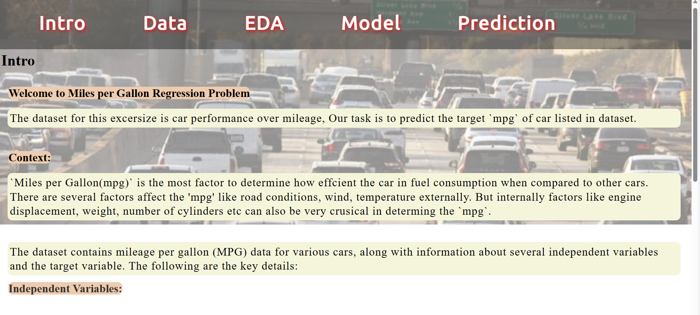
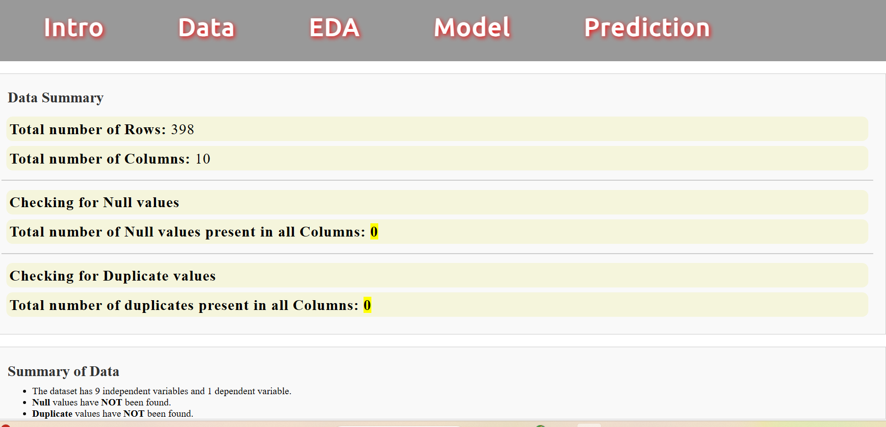
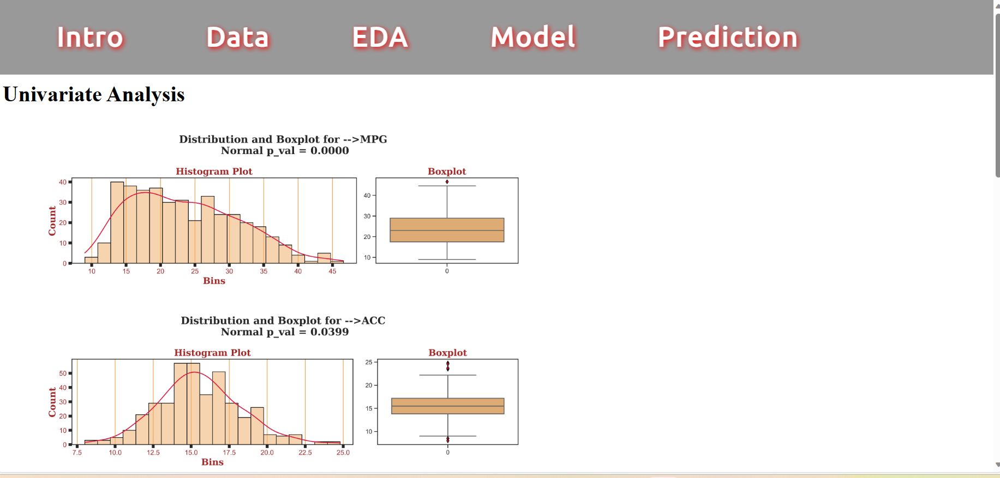
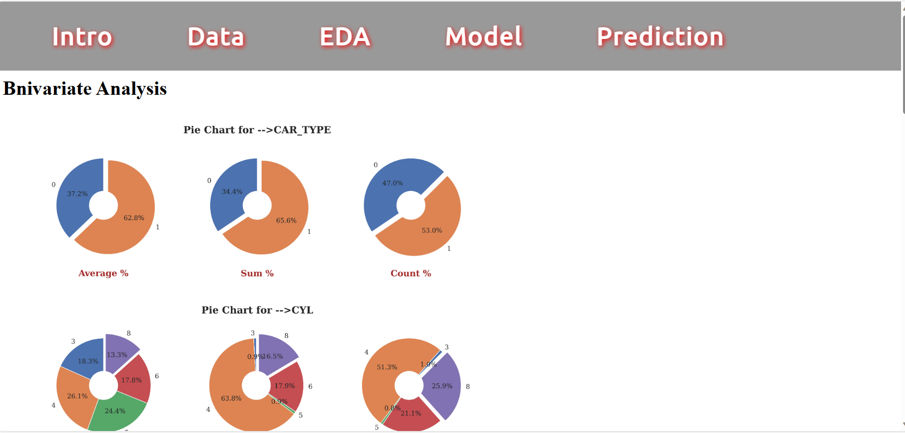
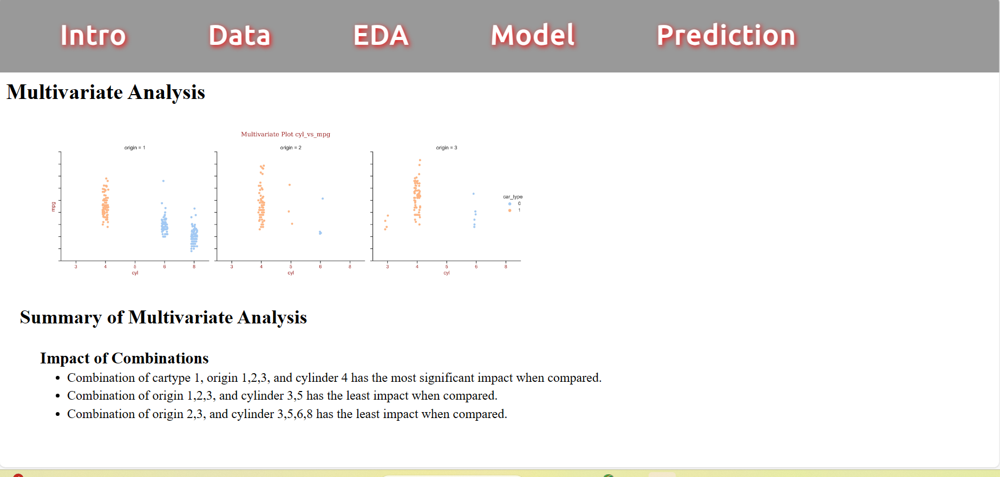
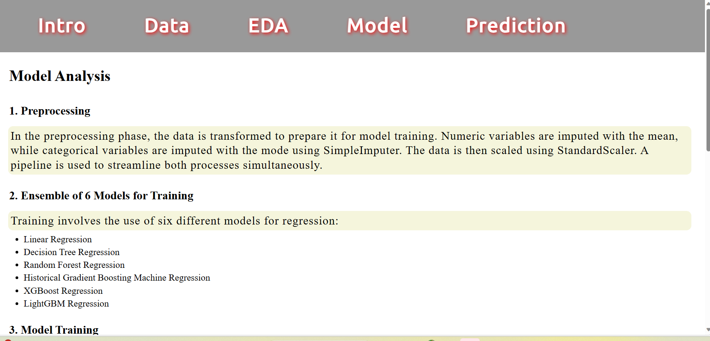
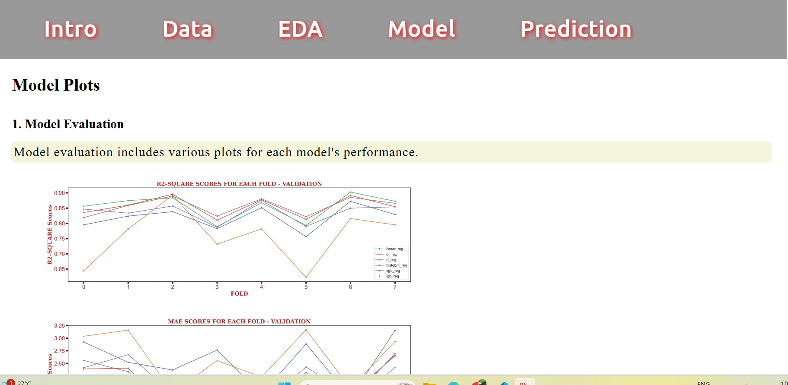
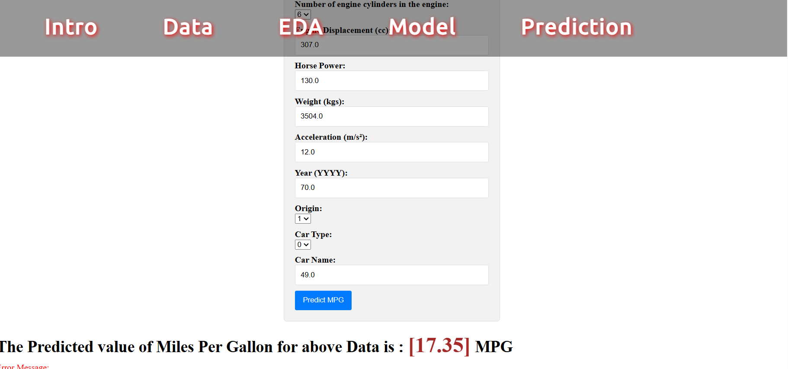

# regression_car_mpg_sample_project
Regression Model for car mpg sample project for heroku deployment

# EDA 
Exploratory data analysis performed on dataset

# Model Analysis
Model is analysed for several different algorightms for prediction.
The best model is chosen and then regression and error plots were plotted

# Just run app.y amd make sure you have all respective libraries

# Intro Page

# Data Page

# EDA/Univariate analysis Page

# EDA/Bivariate analysis Page

# EDA/Multivariate analysis Page

# Model/Model plots Page

# Model/Model analysis Page

# Prediction Page
